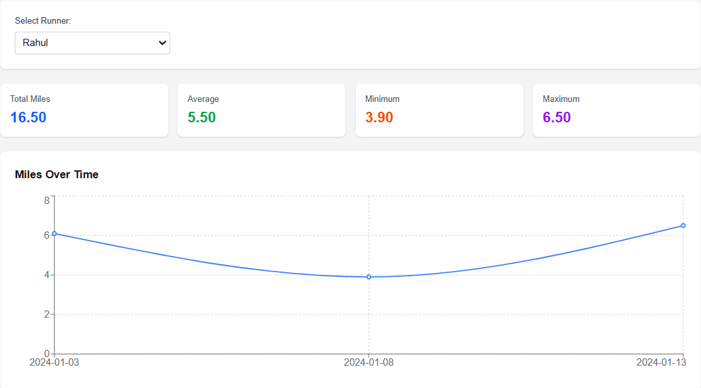

# CSV Runner Dashboard

A Next.js web application for analyzing running data from CSV files. Upload a CSV with runner information and visualize their performance through interactive charts and statistics.

## 📸 Dashboard Screenshots

### Dashboard Overview


### Overall Metrics


### Per Runner View


### Overall View

### Error Handling


## 📋 Project Overview

**Challenge:** CSV Runner Dashboard (Next.js)

**What I Built:**
This is a single-page dashboard application that allows users to upload CSV files containing running data and instantly visualize it through charts and statistics. The application provides both overall insights across all runners and individual per-person analysis.

**Tech Stack:**
- Next.js 14 (App Router)
- React 18
- Recharts (for data visualization)
- Tailwind CSS (for styling)
- JavaScript (ES6+)

---

## 🤔 Assumptions & Design Decisions

1. **CSV Format:**
   - Headers must be exactly: `date`, `person`, `miles run` (case-insensitive)
   - Columns must be in any order
   - Dates can be in any valid date format (YYYY-MM-DD, MM/DD/YYYY, etc.)
   - Miles must be positive numbers (decimals allowed)

2. **Data Processing:**
   - Multiple runs on the same date by different people are aggregated for timeline view
   - Empty lines in CSV are skipped automatically
   - All validation errors are shown with specific row numbers

3. **UI/UX Decisions:**
   - Mobile-first responsive design
   - Line chart for temporal trends (miles over time)
   - Bar chart for comparing total miles between runners
   - Color-coded metric cards for easy scanning
   - Bar chart only shows when "All Runners" is selected

4. **Performance:**
   - Client-side CSV parsing (no server needed)
   - All calculations happen in-memory
   - Charts re-render only when data/selection changes

---

## ⚙️ Prerequisites

- **Node.js:** v18.17.0 or higher
- **npm:** v9.0.0 or higher (comes with Node.js)
- **Browser:** Modern browser with JavaScript enabled (Chrome, Firefox, Safari, Edge)
- **No database required** - all processing is done client-side

---

## 🚀 Setup Instructions

### 1. Clone the Repository

```bash
git clone https://github.com/maheswari8074/CSV-Runner-Dashboard.git
cd runner-dashboard
```

### 2. Install Dependencies

```bash
npm install
```

This will install:
- Next.js framework
- React libraries
- Recharts for visualization
- Tailwind CSS for styling

### 3. Environment Variables

**This project requires NO environment variables.** All processing is done client-side.

For demonstration purposes, an `.env.example` file is included (empty):

```bash
# No environment variables needed for this project
# All CSV processing is done client-side
```

### 4. Verify Installation

Check that all dependencies installed correctly:

```bash
npm list --depth=0
```

You should see:
- `next`
- `react`
- `react-dom`
- `recharts`
- `tailwindcss`

---

## 🏃 Run & Verify

### Start Development Server

```bash
npm run dev
```

The application will start at: **http://localhost:3000**

### Build for Production (Optional)

```bash
npm run build
npm start
```

---

## ✅ Acceptance Criteria Validation

### 1. Sample CSV File

A sample CSV file is provided at `public/sample.csv`:

```csv
date,person,miles run
2024-01-01,Amit,5.2
2024-01-02,Priya,3.8
2024-01-03,Rahul,6.1
2024-01-04,Neha,4.0
2024-01-05,Vikram,5.6
2024-01-06,Amit,4.4
2024-01-07,Priya,5.1
2024-01-08,Rahul,3.9
2024-01-09,Neha,4.8
2024-01-10,Vikram,6.2
2024-01-11,Amit,5.7
2024-01-12,Priya,4.3
2024-01-13,Rahul,6.5
2024-01-14,Neha,5.0
2024-01-15,Vikram,7.1
```

**How to Test:**

1. Open [http://localhost:3000](http://localhost:3000)
2. Click **"Choose File"**
3. Navigate to `public/sample.csv` or download the sample
4. Upload the file
5. Dashboard should display with all visualizations

---

### 2. CSV Parsing & Validation

**Test Valid Upload:**

* ✅ Upload `sample.csv`
* ✅ Dashboard renders successfully with charts and metrics

**Test Invalid Headers:**
Create `invalid_headers.csv`:

```csv
date,name,distance
2024-01-01,Amit,5.2
```

* ✅ Error shown: **"Missing 'person' column"**

**Test Invalid Date:**
Create `invalid_date.csv`:

```csv
date,person,miles run
not-a-date,Amit,5.2
```

* ✅ Error shown: **"Row 2: Invalid date"**

**Test Invalid Miles:**
Create `invalid_miles.csv`:

```csv
date,person,miles run
2024-01-01,Amit,abc
```

* ✅ Error shown: **"Row 2: Invalid miles value"**

**Test Negative Miles:**
Create `negative_miles.csv`:

```csv
date,person,miles run
2024-01-01,Amit,-5.2
```

* ✅ Error shown: **"Row 2: Miles cannot be negative"**

---

### 3. Overall View Metrics

After uploading `sample.csv`, verify:

* ✅ **Total Miles:** **77.7**
* ✅ **Average Miles:** **5.18** (77.7 ÷ 15 runs)
* ✅ **Minimum Miles:** **3.8**
* ✅ **Maximum Miles:** **7.1**

---

### 4. Overall View Charts

**Line Chart – Miles Over Time:**

* ✅ X-axis shows dates from **2024-01-01** to **2024-01-15**
* ✅ Y-axis shows miles run
* ✅ Line connects data points chronologically
* ✅ Hover displays exact date and miles value

**Bar Chart – Total Miles by Runner:**

* ✅ Displayed when **"All Runners"** is selected
* ✅ X-axis shows runner names (**Amit, Priya, Rahul, Neha, Vikram**)
* ✅ Y-axis shows total miles
* ✅ Bars are color-coded

**Expected Total Miles per Runner:**

* **Amit:** **15.3 miles**
* **Priya:** **13.2 miles**
* **Rahul:** **16.5 miles**
* **Neha:** **13.8 miles**
* **Vikram:** **18.9 miles**

---

### 5. Per-Person View

**Test Individual Runner Selection:**

1. Select **"Amit"**

   * ✅ Total Miles: **15.3**
   * ✅ Average Miles: **5.10**
   * ✅ Line chart shows only Amit’s runs

2. Select **"Priya"**

   * ✅ Total Miles: **13.2**
   * ✅ Average Miles: **4.40**
   * ✅ Line chart updates accordingly

3. Select **"Rahul"**

   * ✅ Total Miles: **16.5**
   * ✅ Average Miles: **5.50**
   * ✅ Line chart updates accordingly

4. Select **"Neha"**

   * ✅ Total Miles: **13.8**
   * ✅ Average Miles: **4.60**
   * ✅ Line chart updates accordingly

5. Select **"Vikram"**

   * ✅ Total Miles: **18.9**
   * ✅ Average Miles: **6.30**
   * ✅ Line chart updates accordingly

6. Select **"All Runners"**

   * ✅ Returns to overall view
   * ✅ Bar chart reappears

---

### 6. Error Handling

**Empty File:**

* ✅ Error shown: **"CSV must have at least header and one data row"**

**Missing File:**

* ✅ No action taken (no error thrown)

**Wrong File Type (.txt, .pdf):**

* ✅ Error shown: **"Please upload a CSV file"**

**Empty Person Field:**

* ✅ Error shown: **"Row X: Person name is empty"**

---


## 🎨 Features & Limitations

### ✅ What Works

1. **CSV Upload & Parsing**
   - Drag-and-drop or click to upload
   - Automatic header detection
   - Row-by-row validation with specific error messages

2. **Data Visualization**
   - Interactive line chart (miles over time)
   - Bar chart (total miles by person)
   - Responsive design (mobile, tablet, desktop)

3. **Statistics**
   - Real-time metric calculations
   - Overall and per-person views
   - Average, minimum, maximum, total miles

4. **User Experience**
   - Clean, intuitive interface
   - Dropdown to switch between runners
   - Color-coded metrics for quick scanning
   - Loading states and error messages

5. **Validation**
   - Header validation
   - Date format validation
   - Numeric validation for miles
   - Empty field detection

### ⚠️ Known Limitations

1. **File Size**
   - Not optimized for very large files (10,000+ rows)
   - All processing is done in-memory

2. **Chart Features**
   - No zoom or pan functionality
   - No data export options
   - Limited customization of chart colors

3. **Data Persistence**
   - Data is cleared on page refresh
   - No database or localStorage implementation

4. **Browser Support**
   - Requires modern browser with FileReader API
   - Not tested on Internet Explorer

### 🚀 Future Improvements

1. **Enhanced Features**
   - Download processed data as JSON/CSV
   - Compare multiple runners side-by-side
   - Date range filtering
   - Weekly/monthly aggregations

2. **Performance**
   - Lazy loading for large datasets
   - Virtual scrolling for data tables
   - Web Workers for CSV parsing

3. **Visualization**
   - More chart types (pie, area, scatter)
   - Trend lines and predictions
   - Customizable color schemes
   - Export charts as images

4. **Data Management**
   - LocalStorage for recent uploads
   - Multiple file comparison
   - Edit data inline
   - Undo/redo functionality

---

## 🏗️ Architecture Notes

### Folder Structure

```
runner-dashboard/
├── public/
│   ├── sample.csv          # Sample data file
│   └── screenshots/         # Dashboard screenshots (for README)
├── src/
│   ├── app/
│   │   ├── layout.js       # Root layout with metadata
│   │   ├── page.js         # Main dashboard component
│   │   └── globals.css     # Global styles (Tailwind)
├── package.json            # Dependencies and scripts
├── tailwind.config.js      # Tailwind configuration
├── next.config.js          # Next.js configuration
├── .gitignore              # Git ignore rules
├── .env.example            # Environment variables template (empty)
└── README.md               # This file
```

### Key Components

**Single Component Architecture:**

The entire application is built as a single component (`page.js`) for simplicity. For a larger application, this would be split into:

- `FileUpload.js` - File input and validation
- `StatisticsCards.js` - Metric display cards
- `TimelineChart.js` - Line chart component
- `PersonChart.js` - Bar chart component
- `RunnerSelector.js` - Dropdown selector
- `utils/csvParser.js` - CSV parsing logic

**Why Single Component?**
- Easier to understand for reviewers
- Simpler state management
- No prop drilling
- Faster development for small projects

### State Management

**React useState Hooks:**

```javascript
const [csvData, setCsvData] = useState([]);        // Stores parsed CSV
const [error, setError] = useState('');            // Stores error messages
const [selectedRunner, setSelectedRunner] = useState('all'); // Current filter
```

**Data Flow:**

1. User uploads file → `handleFileUpload()`
2. File is read → `FileReader API`
3. Text is parsed → `parseCSV()`
4. Validation occurs → throw errors or store data
5. State updates → `setCsvData(parsed)`
6. React re-renders → calculations run
7. Charts display → Recharts consumes data

**No External State Management:**
- No Redux, Zustand, or Context API needed
- Simple prop-less architecture
- All state is local to the component

### Data Processing Approach

**Parsing Strategy:**
- Split by newlines to get rows
- Split by commas to get columns
- Validate each cell individually
- Collect errors with row numbers
- Only proceed if no errors

**Calculation Strategy:**
- Filter data based on selected runner
- Loop through filtered data once
- Calculate all metrics in single pass
- Use JavaScript Math.min/max for efficiency

**Chart Data Transformation:**
- Group by date for timeline
- Sum miles for same dates
- Create array of {date, miles} objects
- Recharts handles rendering

---

## ♿ Accessibility & UI

### Accessibility Features

1. **Semantic HTML**
   - Proper heading hierarchy (h1, h2, h3)
   - Label elements for form inputs
   - Button and input elements with proper types

2. **Keyboard Navigation**
   - File input is keyboard accessible
   - Dropdown is keyboard navigable
   - Tab order is logical

3. **Screen Reader Support**
   - Alt text for icons (if images used)
   - Descriptive labels for inputs
   - Error messages are announced

4. **Color Contrast**
   - Text meets WCAG AA standards
   - Error messages use high contrast
   - Chart colors are distinguishable

5. **Focus Indicators**
   - Visible focus states on interactive elements
   - Focus is not removed from inputs

### UI Design Principles

**Typography:**
- System font stack for fast loading
- Clear hierarchy (h1: 36px, h2: 24px, body: 16px)
- Adequate line height (1.5) for readability

**Spacing:**
- Consistent padding/margin (4px, 8px, 16px, 24px)
- White space between sections
- Card-based layout for content grouping

**Color Palette:**
- Gray-100 background (neutral, easy on eyes)
- White cards (clear content separation)
- Blue (#3b82f6) for data visualization
- Green (#10b981) for secondary charts
- Red (#ef4444) for errors

**Responsive Design:**
- Mobile: Single column, stacked cards
- Tablet: 2-column grid for metrics
- Desktop: Full-width charts, 4-column metrics

**Loading States:**
- Empty state shows file icon and instructions
- Error states show clear messages with icons
- Success states immediately show data

---

## 🧪 Testing Scenarios

### Manual Testing Checklist

- [ ] Upload valid CSV → Dashboard displays
- [ ] Upload invalid headers → Error shown
- [ ] Upload invalid date → Error shown with row number
- [ ] Upload invalid miles → Error shown
- [ ] Upload non-CSV file → Error shown
- [ ] Select different runners → Charts update
- [ ] Verify all metrics are correct
- [ ] Test on mobile device → Responsive layout
- [ ] Test keyboard navigation → All inputs accessible
- [ ] Refresh page → Data is cleared (expected behavior)

---

## 📝 Commands Reference

```bash
# Install dependencies
npm install

# Run development server
npm run dev

# Build for production
npm run build

# Start production server
npm start

# Lint code
npm run lint
```

---

## 🐛 Troubleshooting

**Problem:** "Module not found: recharts"
```bash
# Solution:
npm install recharts
```

**Problem:** Port 3000 already in use
```bash
# Solution: Use different port
PORT=3001 npm run dev
```

**Problem:** Changes not reflecting
```bash
# Solution: Clear Next.js cache
rm -rf .next
npm run dev
```

**Problem:** CSV not parsing
- Check CSV has proper headers: date, person, miles run
- Ensure no extra spaces in headers
- Verify file is saved as .csv, not .txt

---


## 👤 Author

**Maheswari Mudadla**  
- GitHub: [@maheswari8074](https://github.com/yourusername)
- Email: maheswarimudadla756@gmail.com

---


**Last Updated:** December 2024